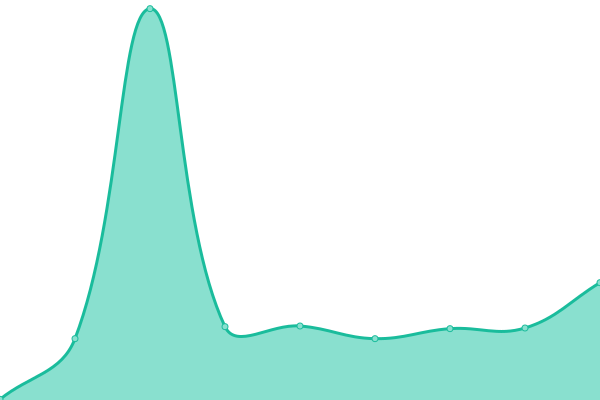
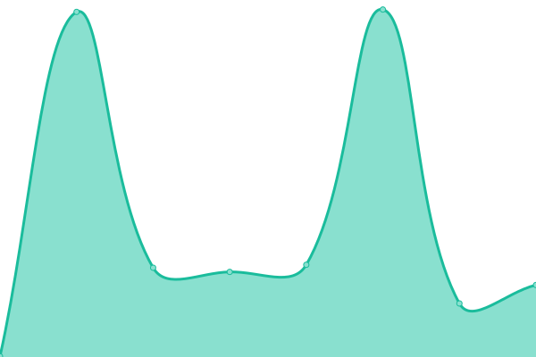

# [📈 Live Status](https://status.amagno.cloud): <!--live status--> **🟧 Partial outage**

This repository contains the open-source uptime monitor and status page for [Amagno](https://status.amagno.cloud), powered by [Upptime](https://github.com/upptime/upptime).

With [Upptime](https://upptime.js.org), you can get your own unlimited and free uptime monitor and status page, powered entirely by a GitHub repository. We use [Issues](https://github.com/amagno-io/upptime/issues) as incident reports, [Actions](https://github.com/amagno-io/upptime/actions) as uptime monitors, and [Pages](https://status.amagno.cloud) for the status page.

<!--start: status pages-->
<!-- This summary is generated by Upptime (https://github.com/upptime/upptime) -->
<!-- Do not edit this manually, your changes will be overwritten -->
<!-- prettier-ignore -->
| URL | Status | History | Response Time | Uptime |
| --- | ------ | ------- | ------------- | ------ |
|  [Amagno Business Cloud](https://amagno.cloud/) | 🟩 Up | [amagno-business-cloud.yml](https://github.com/amagno-io/upptime/commits/HEAD/history/amagno-business-cloud.yml) | 

 539ms
     
 | 

<a href="https://status.amagno.cloud/history/amagno-business-cloud">100.00%</a>
    

|  [Amagno Business Cloud (Main)](https://amagno.cloud/amagnoservice/amagnoservice.svc) | 🟩 Up | [amagno-business-cloud-main.yml](https://github.com/amagno-io/upptime/commits/HEAD/history/amagno-business-cloud-main.yml) | 

 128ms
     
 | 

<a href="https://status.amagno.cloud/history/amagno-business-cloud-main">100.00%</a>
    

|  [Amagno Business Cloud (Maintenance)](https://amagno.cloud/amagnomaintenanceservice/maintenanceservice.svc) | 🟩 Up | [amagno-business-cloud-maintenance.yml](https://github.com/amagno-io/upptime/commits/HEAD/history/amagno-business-cloud-maintenance.yml) | 

 127ms
     
 | 

<a href="https://status.amagno.cloud/history/amagno-business-cloud-maintenance">100.00%</a>
    

|  [Amagno Business Cloud (Events)](http://amagno.cloud/amagnoeventservice) | 🟩 Up | [amagno-business-cloud-events.yml](https://github.com/amagno-io/upptime/commits/HEAD/history/amagno-business-cloud-events.yml) | 

 290ms
     
 | 

<a href="https://status.amagno.cloud/history/amagno-business-cloud-events">100.00%</a>
    

|  [Amagno API](https://amagno.me/api/v2/me) | 🟩 Up | [amagno-api.yml](https://github.com/amagno-io/upptime/commits/HEAD/history/amagno-api.yml) | 

 574ms
     
 | 

<a href="https://status.amagno.cloud/history/amagno-api">100.00%</a>
    

|  [Amagno API Documentation](https://amagno.me/api/v2) | 🟩 Up | [amagno-api-documentation.yml](https://github.com/amagno-io/upptime/commits/HEAD/history/amagno-api-documentation.yml) | 

 383ms
     
 | 

<a href="https://status.amagno.cloud/history/amagno-api-documentation">100.00%</a>
    

|  [Amagno Mobile Explorer](https://amagno.me) | 🟩 Up | [amagno-mobile-explorer.yml](https://github.com/amagno-io/upptime/commits/HEAD/history/amagno-mobile-explorer.yml) | 

 324ms
     
 | 

<a href="https://status.amagno.cloud/history/amagno-mobile-explorer">100.00%</a>
    

|  [Amagno WebDAV](https://amagno.me/webdav) | 🟥 Down | [amagno-web-dav.yml](https://github.com/amagno-io/upptime/commits/HEAD/history/amagno-web-dav.yml) | 

 642ms
     
 | 

<a href="https://status.amagno.cloud/history/amagno-web-dav">0.00%</a>
    

|  [amagno.de](https://amagno.de) | 🟩 Up | [amagno-de.yml](https://github.com/amagno-io/upptime/commits/HEAD/history/amagno-de.yml) | 

 1318ms
     
 | 

<a href="https://status.amagno.cloud/history/amagno-de">100.00%</a>
    

|  [amagno.ch](https://amagno.ch) | 🟩 Up | [amagno-ch.yml](https://github.com/amagno-io/upptime/commits/HEAD/history/amagno-ch.yml) | 

 1193ms
     
 | 

<a href="https://status.amagno.cloud/history/amagno-ch">100.00%</a>
    

|  [amagno.co.uk](https://amagno.co.uk) | 🟩 Up | [amagno-co-uk.yml](https://github.com/amagno-io/upptime/commits/HEAD/history/amagno-co-uk.yml) | 

 1259ms
     
 | 

<a href="https://status.amagno.cloud/history/amagno-co-uk">100.00%</a>
    

<!--end: status pages-->

[**Visit our status website →**](https://status.amagno.cloud)

## 📄 License

- Powered by: [Upptime](https://github.com/upptime/upptime)
- Code: [MIT](./LICENSE) © [Amagno](https://status.amagno.cloud)
- Data in the `./history` directory: [Open Database License](https://opendatacommons.org/licenses/odbl/1-0/)
